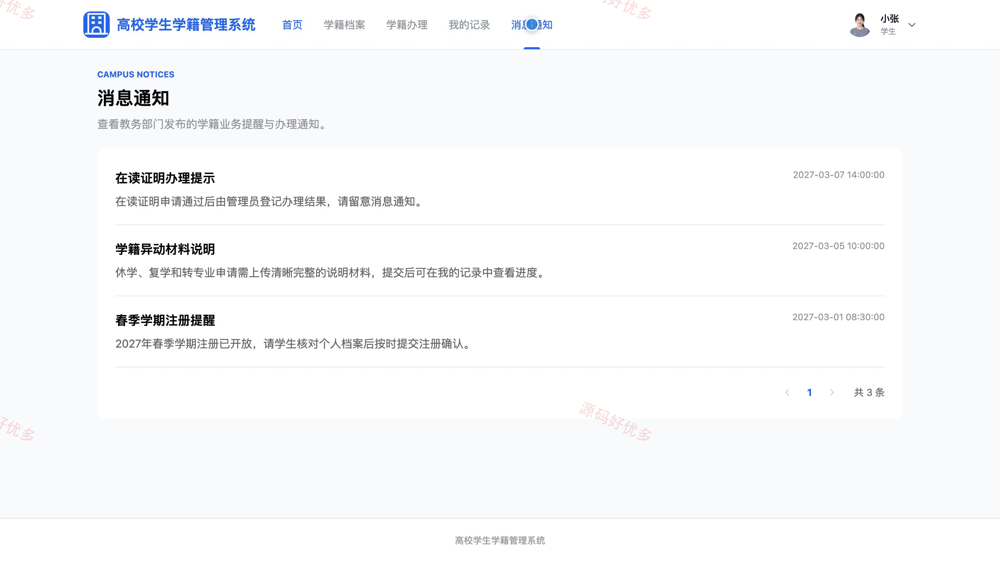
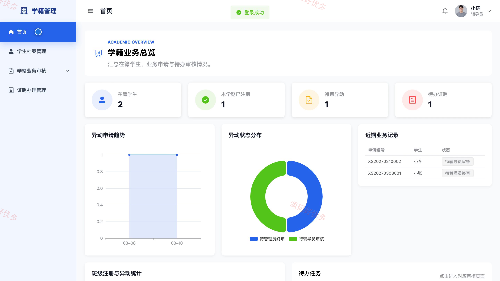
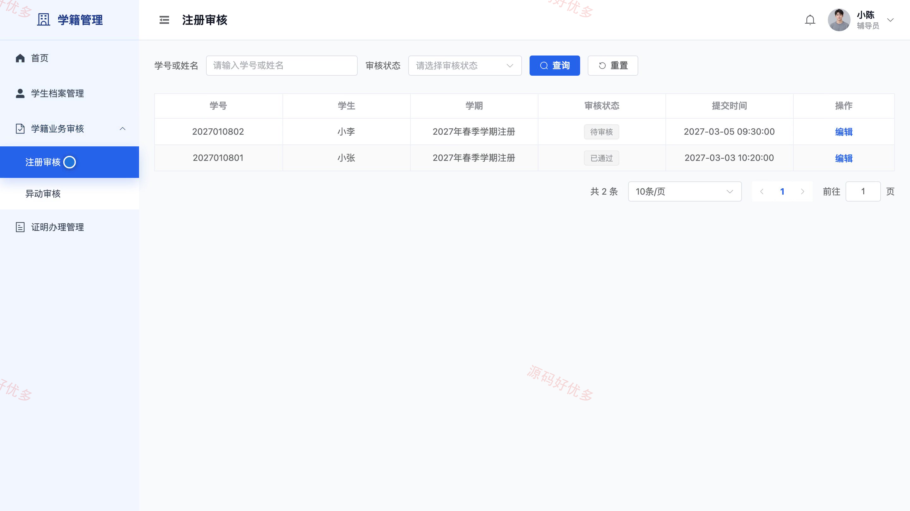
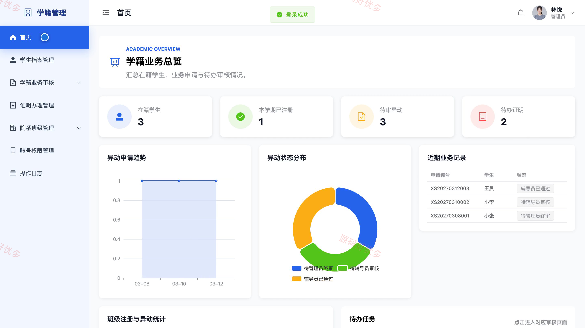
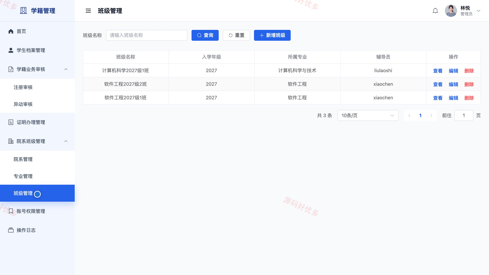

# bs108A
bs108A高校学生学籍管理系统
## 源码问题查看主页咨询

### 一、关键词
高校学籍、学籍档案、学生事务、学期注册、在读证明

### 二、作品包含
源码+数据库+万字设计文档+PPT+全套环境和工具资源+本地部署教程

### 三、项目技术
前端技术： Html、Css、Js、Vue3.4、Element-Plus
后端技术：Java、SpringBoot3.2.0、MyBatis-Plus

### 四、运行环境（以下版本亲测，其他版本兼容性请自行测试）
开发工具：IDEA/eclipse + VSCODE

数据库：MySQL5.7+（共14张表）

数据库管理工具：Navicat10以上版本

环境配置软件： JDK17 + Maven

前端Nodejs：20

浏览器：谷歌浏览器

### 五、项目介绍
项目编号：bs108A

高校学生学籍管理系统面向学生、辅导员和管理员，围绕学籍档案、学期注册、学籍异动与在读证明形成在线申请、分级审核、结果查询和操作留痕的业务闭环。

角色：学生、辅导员、管理员

学生功能：个人学籍档案、学期注册、学籍异动申请、在读证明申请、办理记录查询、消息通知。

辅导员功能：学生档案查询、学期注册审核、学籍异动初审、在读证明初审、班级数据统计、班级通知管理。

管理员功能：学生档案管理、学期注册审核、学籍异动终审、在读证明办理、院系专业班级管理、账号权限管理、数据统计、操作日志。

### 六、运行截图

